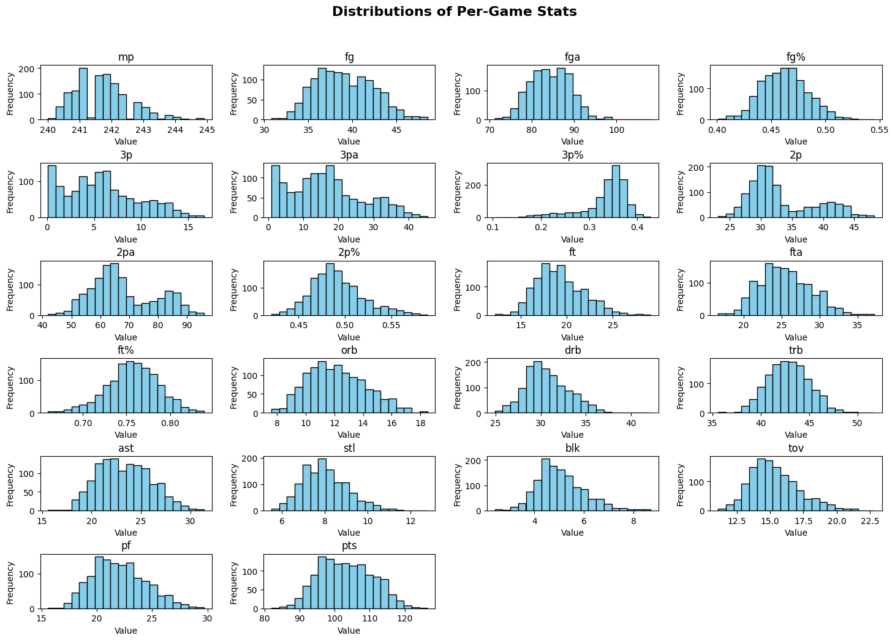
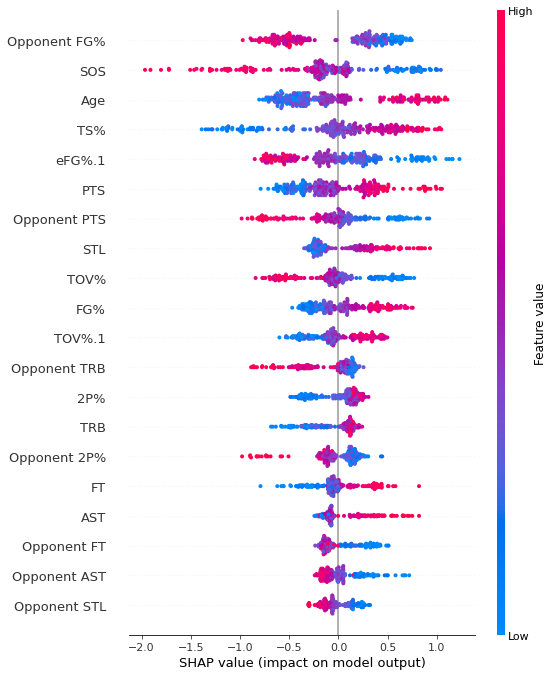

# Predicting Playoff Potential: Key Factors Behind NBA Playoff Teams

## Team

**Team Members:**
- Collin Kneiss (GitHub ID: cjkneiss) - Point of Contact (POC)
- Ankit Waikar (GitHub ID: awaikar-syr)
- Odbileg Erdenebileg (GitHub ID: odko123)

---

## Introduction

Our goal is to predict which NBA teams will make the playoffs and identify the key performance metrics driving success. By analyzing over 40 years of historical data, we aim to create a predictive model that provides actionable insights to coaches, analysts, and team front offices. The model focuses on metrics like shooting efficiency, defensive rating, and turnover management—areas that teams can actively influence to improve performance. 

The primary stakeholders are NBA coaches, analysts, fans, and team front offices. Coaches can use these insights to develop targeted improvement strategies, analysts can better understand team dynamics, and front offices can optimize resource allocation and player acquisition strategies. Additionally, gamblers could leverage these insights to make data-informed bets, potentially increasing their chances of success. This work serves as an incremental step toward comprehensive decision-support tools for maximizing playoff potential.

---

## Literature Review

Basketball analytics has traditionally relied on basic metrics such as points, rebounds, and assists to evaluate team performance. While these metrics are useful, they fail to capture the broader dynamics of gameplay, such as opponent strength, game location, or player fatigue. Advanced metrics such as Player Efficiency Rating (PER) and Win Shares have been developed to address some of these gaps ([PER Explanation](https://www.cryptbeam.com/2020/11/11/advanced-statistics-and-plus-minus-data/), [Win Shares Explanation](https://www.basketball-reference.com/about/ws.html)). However, these methods still have limitations when applied in isolation.

Recent studies have shown that machine learning models can uncover complex relationships between a wide range of variables and outcomes in sports analytics. Classification models, for instance, have been used to predict game outcomes, while regression models have been employed for player performance projections. Despite these advances, there remains a gap in applying machine learning techniques to team-level playoff predictions that account for both basic and advanced metrics. By leveraging a combination of traditional statistics and advanced analytics, this project addresses this gap.

---

## Data and Methods

### Data

Our dataset is sourced from Basketball Reference, a reputable and widely used resource for NBA statistics ([Dataset Link](https://www.basketball-reference.com/)). The dataset contains information on team performance over 1,254 team-seasons from 1980 to 2021, with 78 features including per-game statistics, advanced metrics, and opponent statistics. The full dataset can be found in the [GitHub Repository](https://github.com/SU-IST707/student-group-project-the-a-team/blob/main/checkpoint2/IST707_NBA_Data.csv) and on [Google Drive](https://drive.google.com/file/d/1LesCcSZLgrwxUpxxlMSWahmYHsx0JgjV/view?usp=sharing).

#### Key Variables:

| Column | Explanation |
|--------|-------------|
| Rk     | Rank of the team based on overall performance. |
| Team   | Team name. An asterisk (*) indicates a playoff team. |
| G      | Total number of games played. |
| MP     | Minutes Played per game. |
| FG     | Field Goals made per game. |
| FG%    | Field Goal Percentage. |
| 3P     | 3-Point Field Goals made per game. |
| eFG%   | Effective Field Goal Percentage. |
| DRB    | Defensive Rebounds per game. |
| PTS    | Points scored per game. |
| Playoff| Target variable indicating playoff qualification (1 for playoff teams, 0 otherwise). |

#### Dataset Validation:
1. **Cross-Verification**: Random samples were compared with official NBA statistics to ensure accuracy.
2. **Source Reputation**: Basketball Reference is widely regarded as reliable among sports analysts and researchers.

#### Visualizations:
1. **Feature Distributions**:
    - Histograms show that variables like field goal percentages and points scored follow normal or slightly skewed distributions.
    - This helps identify trends, such as the increasing emphasis on 3-point shots in recent years.

    

2. **Correlation with Playoff Qualification**:
    - Variables like TS% (True Shooting Percentage), Strength of Schedule (SOS) and eFG% (Effective Field Goal Percentage) show strong positive correlations with playoff participation.

   

### Methods

#### Preprocessing
1. **Data Cleaning**:
   - Dropped irrelevant columns (e.g., rank, arena, attendance).
   - Filled missing values in attendance data using historical averages.
2. **Feature Scaling**:
   - Applied StandardScaler to normalize numeric features.
3. **Multicollinearity Handling**:
   - Calculated Variance Inflation Factors (VIF) and removed features with VIF > 5.

#### Modeling Approach
1. **Dimensionality Reduction**:
   - Applied Principal Component Analysis (PCA) to retain 95% of the variance while reducing feature dimensions. PCA was recommended by our professor and helped address issues with multicollinearity.
2. **Machine Learning Models**:
   - **Logistic Regression**: Baseline model with L2 regularization.(Hyperparameters: `max_iter=1000, random_state=42`)
   - **Random Forest**: Non-linear ensemble model to capture complex relationships. (Hyperparameters: `n_estimators=100, random_state=42`)
   - **XGBoost**: Gradient boosting algorithm optimized for classification tasks.
3. **Evaluation Metrics**:
   - Used cross-validation and metrics like accuracy, F1-score, AUC-ROC, and confusion matrices to evaluate model performance.

---

## Results

### Model Performance

| Model             | ROC-AUC | Accuracy |
|-------------------|---------|----------|
| Logistic Regression | 0.541   | 0.577    |
| Random Forest      | 0.853   | 0.853    |
| Gradient Boosting  | 0.871   | 0.869    |

#### Key Observations:
- Logistic Regression struggled compared to ensemble methods, reflecting its linear nature.
- Random Forest and Gradient Boosting performed well, with Gradient Boosting achieving the highest ROC-AUC.

### Feature Importance
- **Random Forest & XGBoost**: Top predictors included Strength of Schedule (SOS), Defensive Rating, and Shooting Efficiency.

#### Visualizations:
1. **Confusion Matrices**: To evaluate classification performance visually (included in notebooks).
2. **ROC Curve**: All models displayed high AUC for ensemble methods (included in notebooks).

---

## Discussion

Our results demonstrate that advanced metrics like Net Rating and Effective Field Goal Percentage are critical to predicting playoff qualification. Coaches and analysts can use these insights to optimize strategies, while fans and gamblers gain a better understanding of team performance.

However, challenges remain. For instance, the model struggles with "`Cinderella`" teams that defy statistical norms, as well as mid-season injuries that alter team dynamics. Despite these challenges, our work provides actionable insights for stakeholders, enabling targeted improvements in shooting efficiency and defensive strategies.

---

## Limitations

1. **Data Quality**:
   - Reliance on historical data may not capture future trends in gameplay or team dynamics.
2. **Feature Selection**:
   - Potential for overfitting due to multicollinearity in Random Forest.
3. **Dynamic Nature of Basketball**:
   - Factors like injuries or coaching changes are not fully accounted for.
4. **Predictive Scope**:
   - The model provides probabilities but cannot explain qualitative aspects like team morale.

---

## Future Work

1. **Enhanced Data Sources**:
   - Incorporate real-time game data and player-level statistics.
2. **Advanced Modeling**:
   - Explore ensemble techniques and hyperparameter optimization for XGBoost.
3. **Feature Engineering**:
   - Develop new features to capture qualitative aspects like team chemistry.
4. **Deployment**:
   - Build an interactive tool for stakeholders to explore playoff probabilities and key metrics.

---

## References

1. Basketball Reference: [https://www.basketball-reference.com](https://www.basketball-reference.com)
2. Advanced Basketball Metrics Literature: Relevant studies on [PER](https://www.cryptbeam.com/2020/11/11/advanced-statistics-and-plus-minus-data/), [Win Shares](https://www.basketball-reference.com/about/ws.html), and [ML applications in sports analytics](https://www.tandfonline.com/doi/full/10.1080/24751839.2021.1977066#d1e1239). 

---
